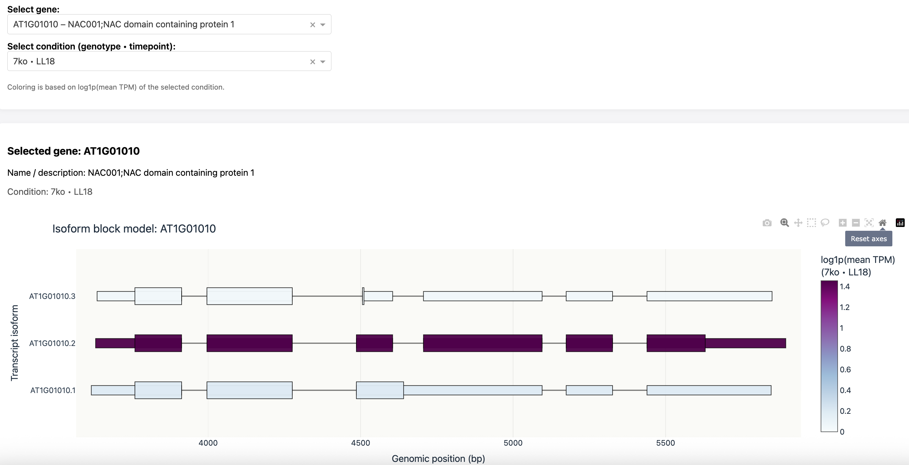

# IsoformExpression





IsoformExpression is a Dash-based interactive dashboard for visualizing
gene isoform structures (exons and CDS) colored by mean transcript expression (TPM).

The tool is designed for exploratory analysis of alternative splicing
and isoform-specific expression patterns using transcript-level RNA-seq data.


---

### Why this Tool?

- An interactive visualization of exon–intron structures alongside transcript expression
- Direct comparison of isoforms within a gene under different experimental conditions
- Rapid exploratory analysis without requiring manual plotting or genome browser inspection

The dashboard is **not intended to replace** existing quantification or statistical tools.
Instead, it is designed as a **complementary visualization layer** that supports:

- Quality control of transcript-level expression results
- Hypothesis generation regarding alternative splicing events
- Teaching and demonstration of isoform-specific regulation

By combining isoform structure and expression in a single interactive view, 
IsoformExpression bridges the gap between statistical RNA-seq analysis and genome 
browser–based inspection.

### Complementary tools

IsoformExpression is designed to work alongside:

- Salmon / Kallisto – transcript quantification
- DESeq2 / edgeR – statistical differential expression analysis
- Genome browsers (IGV, UCSC) – detailed genomic inspection

--- 

## Features

- Interactive gene search (AGI identifiers)
- Isoform block model visualization
  - **exons** (rectangles UTR+CDS)
  - **UTR** (thin rectangles)
  - **CDS** (thicker rectangles)
  - **introns** (connecting lines)
- Color encoding based on **log1p(mean TPM across Replicates)**
- Condition selection based on **genotype × timepoint**
- Color scale based on ColorBrewer (BuPu)

---

## Demo data

This repository contains **demo datasets only** located in:

annotation/testdata/

These files are **small subsets** used for demonstration and testing of the dashboard.
Full experimental datasets are intentionally excluded.(not yet published)

The demo datasets included in this repository were generated from full datasets using:

```bash
python scripts/make_demo_subset.py```


## Quickstart (demo)

Run the Dash app with the included demo data:

```bash
python app.py

```
Then open browser : 

http://127.0.0.1:8050/

## How the data is generated (full dataset workflow)

The dashboard expects two main input tables:

### 0) Gene annotation table (gene metadata)

- Input file: `annotation/Thalemine_gene_names.csv`
- Demo subset: `annotation/testdata/Thalemine_gene_names_demo.csv`

This table contains gene-level metadata (AGI identifier, gene name, description)
used for gene search and labeling in the dashboard.

### 1) Isoform structure segments (exon + CDS)

- Output file: `annotation/segments_atrtd3.csv`
- Generated from a reference GTF file using:

```
python scripts/prepare_annotation.py \
  --gtf annotation/atRTD3_TS_21Feb22_transfix.gtf \
  --out annotation/segments_atrtd3.csv
  
  ```
  
### 2) Mean transcript expression table (mean TPM)

-  Input: Salmon quant.sf files from Salmon (one folder per sample) 
-  Output (raw): expression/transcript_expression.csv
-  Output (mean): expression/transcript_expression_mean.csv


``` 
python scripts/build_expression_table_mean.py \
  --base-dir "expressions Daten/AtRTD3_full" \
  --out expression/transcript_expression_mean.csv
  
  ```


---
## Installation

Create a virtual environment (recommended):

```bash
python -m venv venv
source venv/bin/activate```

install dependencies: 

pip install -r requirements.txt


 
## Citation

If you use this tool, please cite:

Asal Sahami Moghaddam,
IsoformExpression: A Dash-based dashboard for isoform-level expression visualization,
GitHub, 2025.